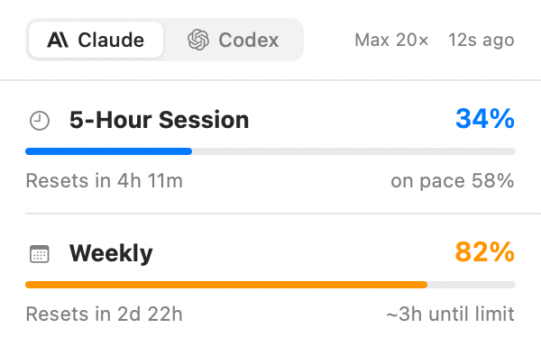
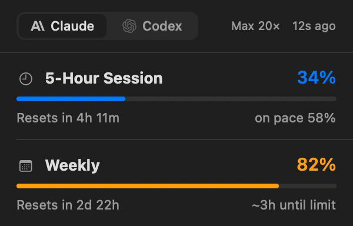

# Margin


A native macOS menu bar app that shows how much runway you have left across
**Claude** and **Codex** — at a glance, from data already on your machine.

<p align="center">
  
  
</p>

Margin is **local-first**: by default it reads only the usage data your tools
already write to disk. No OAuth tokens are sent anywhere, no undocumented
network endpoints, and no credential writeback. Every number is labelled with
where it came from.

## Why another usage meter?

Most menu bar meters show the same bars with the same naive extrapolation.
Margin's direction is a **capacity copilot**: a single glance that tells you
your *most constrained* resource, and eventually which provider to use right
now. This is milestone M2 — the local data layer and the interface.

- [x] **M0** — scaffold, XcodeGen, CI
- [x] **M1** — local providers (Claude cache, Codex rollout logs)
- [x] **M2** — menu bar glyph, popover, settings, provenance labels
- [ ] **M3** — forecast engine + routing advisor + history
- [ ] **M4** — widgets + notifications

## Install

### Download

Grab the latest `Margin-x.y.z.dmg` from
[Releases](../../releases), open it, and drag **Margin** to Applications.

> Releases are notarized when the maintainer's signing secrets are configured.
> If you see a Gatekeeper warning on an unsigned build, right-click the app and
> choose **Open** once, or run `xattr -dr com.apple.quarantine /Applications/Margin.app`.

### Homebrew

```sh
# The release workflow publishes a ready-to-use `margin.rb` cask alongside each
# DMG. Add it to your tap (or install the DMG directly).
brew install --cask marcusjhang/margin/margin
```

### Build from source

Requires Xcode 16+ and [XcodeGen](https://github.com/yonaskolb/XcodeGen):

```sh
brew install xcodegen
make run     # generate, build, and launch
make test    # unit + local integration tests
```

## What it reads

Everything is **read-only**.

| Provider | Source | Provenance |
|---|---|---|
| Claude | `~/.claude.json` → `cachedUsageUtilization` | `cached` |
| Claude | Keychain `Claude Code-credentials` — plan label only | `cached` |
| Codex | `~/.codex/sessions/**/rollout-*.jsonl` → `rate_limits` | `local` |

The keychain is read through the system `/usr/bin/security` binary so macOS
shows **no ACL prompt** and Margin never stamps its own code signature onto
Claude Code's credential item. Margin never writes to another app's credentials.

## Menu bar styles

Pick a style in Settings:

- **Dual capsules** — two fuel gauges, Claude and Codex, filling bottom-up.
- **Binding ring** — one ring for whichever resource is most constrained.
- **Compact text** — `C34 X16`.

Severity tints the fill: provider color normally, amber at ≥75%, red at ≥90%.
A thin tick on each bar marks linear "on pace" progress for the window.

## Architecture

```
MarginCore   logic: models, parsers, providers, store   (static library, testable)
MarginUI     SwiftUI views + design system              (static library)
MarginApp    AppKit menu bar shell + popover            (app)
MarginPreview  dev-only snapshot renderer               (tool)
```

Data flow: `UsageProvider` → `ProviderSnapshot` → `UsageStore` → SwiftUI + the
AppKit menu bar glyph.

## Development

```sh
make generate   # regenerate Margin.xcodeproj from project.yml
make build
make test
make run
VERSION=0.2.0 ./Scripts/package.sh   # build a DMG into dist/
```

Render the UI without launching the app:

```sh
xcodebuild -scheme MarginPreview -configuration Debug -derivedDataPath .build build
.build/Build/Products/Debug/MarginPreview /tmp
```

### Releasing

Push a tag (`v0.2.0`). `.github/workflows/release.yml` builds the DMG and
attaches it to a GitHub Release. Add these repository secrets to sign and
notarize (all optional):

`MACOS_CERTIFICATE_P12`, `MACOS_CERTIFICATE_PASSWORD`, `KEYCHAIN_PASSWORD`,
`DEVELOPER_ID_APPLICATION`, `DEVELOPMENT_TEAM`, `APPLE_ID`, `APPLE_TEAM_ID`,
`APPLE_APP_PASSWORD`.

## License

MIT. Margin is an independent project and is not affiliated with Anthropic or
OpenAI. "Claude" and "ChatGPT"/"Codex" are trademarks of their respective owners.
